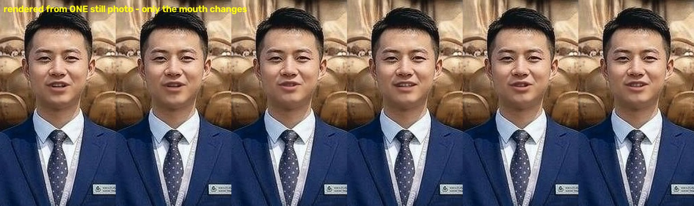

# QHDigitalHuman

**开箱即用的简单数字人资产管理与渲染推流服务。**

把一段真人视频（或一张照片）变成可复用的数字人动作资产，再用它渲染出对口型的视频，
或者直接推到 RTMP 服务器上实时观看。整条链路都在命令行里，不依赖 Web 框架、数据库或
信令服务。

---

## 它能做什么

| 能力 | 命令 | 说明 |
|---|---|---|
| **资产管理** | `preprocess` | 视频 → 人脸框 / 人脸裁剪 / 融合掩码 / VAE latents，落成一套可复用的动作资产 |
| **资产自检** | `check` | 按引擎校验一套资产的完整性与一致性，指出缺哪一项 |
| **模型自检** | `models` | 真实加载配置里的权重并报告参数规模、精度、设备 |
| **离线渲染** | `render` | 资产 + 音频（或一段文本，走 TTS）→ 对口型视频（mp4） |
| **实时推流** | `stream` | 同上，但边渲染边推到 RTMP，HLS/VLC 即可观看 |
| **语音合成** | `--text` | 火山引擎 Seed TTS V3，密钥走 `.env` |

设计上分三层，互不越界：

```
Avatar（数据）      src/domain/avatar.py      资源目录的只读视图
engine（算法）      src/engine/                无状态的 LipSyncInput → LipSyncOutput
session（时序）     src/session/               渲染与推送的交错、推流输出
```

---

## 环境要求

| 项 | 要求 | 备注 |
|---|---|---|
| Python | **3.10** | 由 uv 管理 |
| PyTorch | 2.7.1+cu118（建议） | CUDA 11.8 与 `mmcv` 生态一致 |
| FFmpeg | **8.x**（运行时 DLL + 开发文件） | RTMP 扩展的构建与运行都依赖；`render` 也用它产出带声音的 H.264（可选但强烈建议）。用 `FFMPEG_ROOT` 指向安装目录，或让 `ffmpeg` 在 `PATH` 里 |
| C++ 工具链 | MSVC（Windows）/ gcc | 只在该 RTMP 扩展**从源码构建**时需要 |
| CMake | ≥ 3.18 | 同上 |
| RTMP 服务 | MediaMTX（推荐） | 本地验证推流用，见 [推流与观看](#推流与观看) |
| 显卡 | 建议 ≥ 8 GB 显存 | MuseTalk 的 VAE 解码在 8 GB 卡上已接近上限，见下 |

> FFmpeg 的版本必须和扩展链接的版本一致。本项目要用的那份 RTMP 扩展必须按 **FFmpeg 8**
> （`avcodec-62` / `avformat-62` / `avutil-60` / `swscale-9` / `swresample-6`）自行构建 ——
> 该扩展不随本仓库分发，见[第三方组件与来源](#第三方组件与来源)。

**本项目的开发与实测环境**（所有性能数字都出自这台机器，换机请重测）：

| 项 | 配置 |
|---|---|
| GPU | NVIDIA GeForce RTX 4060 Laptop GPU（8188 MiB，驱动 591.86） |
| CPU | Intel Core i7-14700HX（20 核 / 28 线程） |
| 内存 | 15.8 GB |
| 系统 | Windows 11 家庭版 build 26200 |

在这台机器上，MuseTalk 的渲染能力约 **10 fps**（VAE 解码是瓶颈），低于 25 fps 的时间线，
所以推流时会有**约一半的帧被跳过**（画面卡顿，但口型与动作速度是正确的）。
完整数据与调参依据见[性能实测与调参](#性能实测与调参)。

---

## 快速开始

### 1. 安装

```bash
# 全新环境：创建 .venv 并装齐依赖
uv sync
```

这样就够了 —— **预处理、离线渲染、资产自检、模型自检都能用**。

### 1b. 启用 RTMP 推流（可选）

推流用的 C++/pybind11 扩展**不在本仓库里**（第三方许可原因，见
[第三方组件与来源](#第三方组件与来源)），需要自己放进来：

```bash
# 1) 取得上游源码，放到 vendor/python_rtmpstream/
#    上游：https://github.com/lipku/python_rtmpstream
#    本项目对它的改动记录在 vendor/python_rtmpstream/README.md 里，需要照做

# 2) 装上这个可选依赖（构建需要 FFmpeg 8 的开发文件）
# Windows PowerShell
$env:FFMPEG_ROOT = "D:/.dep/ffmpeg"     # 改成你的 FFmpeg 8 安装目录
uv sync --extra rtmp

# 3) 验证
python -c "import rtmp_streaming; print('rtmp extension OK')"
```

> **构建要点**（都是踩过的坑）：扩展必须按 **FFmpeg 8**（`avcodec-62` 等）构建，
> 上游仓库里可能带着按 FFmpeg 6 链接的预编译产物，直接加载会报"找不到指定的模块"；
> 打包 DLL 时除了 `avcodec-62 / avformat-62 / avutil-60 / swscale-9`，还必须带
> **`swresample-6.dll`**（`avcodec-62` 的传递依赖）。

> **注意**：如果你的 venv 里有手工安装/编译过的包（例如 `mmcv-lite`、源码重建的
> `xtcocotools`），**不要再跑 `uv sync`** —— 它会按 lockfile 把环境裁剪回去。
> 这种情况下只单独装本地包即可：
> `uv pip install --no-deps --reinstall ./vendor/python_rtmpstream/python`

### 2. 做一套动作资产

```bash
python -m src.scripts.preprocess path/to/idle.mp4 --behavior IDLE --action DEFAULT
```

产出落在 `avatar/<index>_<uuid4>/IDLE/DEFAULT/<引擎>/`，随即可用 `check` 复核：

```bash
python -m src.scripts.digitalhuman check avatar
```

### 3. 离线渲染（导出单个视频）

```bash
python -m src.scripts.digitalhuman render \
  --action-dir avatar/0_xxxx/IDLE/DEFAULT/musetalkv15 \
  --audio speech.wav --output out.mp4
# 也支持 --text "要说的话" 直接走 TTS

# action    : avatar/0_xxxx/IDLE/DEFAULT/musetalkv15
# engine    : musetalkv15
# frames    : 150
# blended   : True
# encoder   : ffmpeg (H.264 + AAC)
# output    : out.mp4
```

**输出是带声音的 H.264 MP4**：帧直接以原始 BGR 管道喂给 FFmpeg，只编码一次，
音轨用 AAC 合进同一个文件。**找不到 FFmpeg 时会退回静音的 MPEG-4** 并打印警告，
渲染本身不会失败。

画质用 `--crf` 控制（0-51，越小越好，默认取 `[digitalhuman].render_crf` 的 18）：

```bash
python -m src.scripts.digitalhuman render --action-dir ... --audio speech.wav \
  --output out.mp4 --crf 16      # 更清晰、文件更大
```

> 与 `stream` 不同，`render` **只渲染指定的那一个动作**，不做权重轮换 —— 离线渲染
> 要可复现。要轮换请用 `stream`（或准备一段更长的动作素材）。

### 4. 推流

先把 RTMP 服务起起来（见下一节），然后：

```bash
python -m src.scripts.digitalhuman stream \
  --action-dir avatar/0_xxxx/IDLE/DEFAULT/musetalkv15 \
  --audio speech.wav
# target     : rtmp://127.0.0.1:1935/live/qhdh
# rendered   : 278 frames at 11.5 fps (115% of the 10 fps target)
# latency    : first frame on the wire after 3.45s
# streamed   : video=533 (repeated 284, dropped 0)
# pacing     : batch=4 frames, skipped=0 to stay on the audio clock, content lag=0.17s avg / 0.36s max
# watch      : http://127.0.0.1:8888/live/qhdh/index.m3u8
```

输出到虚拟摄像头（会议软件可直接选用），并把声音从本机扬声器放出来：

```bash
python -m src.scripts.digitalhuman stream \
  --avatar avatar/0_xxxx --behavior IDLE \
  --sink virtualcam,speaker --text "你好，我是一个数字人。"
# camera     : 'OBS Virtual Camera' (obs) frames=216 error=None
# audio      : playing=True error=None
```

`--sink` 可以逗号分隔多路（`rtmp,virtualcam,speaker`）——**一份渲染扇出到多路**，
不会重复渲染。

---

## 推流与观看

`stream` 只负责把音视频推到 RTMP，**不内置服务器**。本地验证推荐
[MediaMTX](https://github.com/bluenviron/mediamtx)：单文件、Windows 原生、持续维护，
并提供 RTMP + HLS + WebRTC。

下载官方 release 的 `mediamtx_vX.Y.Z_windows_amd64.zip` 解压即用（**不要用
`go install`** —— `hls.min.js` 与 `VERSION` 是构建时生成的嵌入资源，模块代理里的源码
缺少它们）。

一份够用的配置：

```yaml
# mediamtx.yml
logLevel: info
logDestinations: [stdout]

api: true
apiAddress: 127.0.0.1:9997     # 查询在线流

rtmp: true
rtmpAddress: :1935             # 推流入口
rtmpEncryption: "no"

hls: true
hlsAddress: :8888              # 观看入口
hlsVariant: mpegts
hlsAlwaysRemux: true           # 常驻转封装；否则首个请求后几秒播放列表是空的

rtsp: false
webrtc: false
srt: false

pathDefaults:
  source: publisher

paths:
  all_others:
```

启动后：

| 用途 | 地址 |
|---|---|
| 推流 | `rtmp://127.0.0.1:1935/live/<路径>` |
| 观看（HLS） | `http://127.0.0.1:8888/live/<路径>/index.m3u8`（VLC / ffplay / 浏览器） |
| 查在线流 | `http://127.0.0.1:9997/v3/paths/list` |

用 ffmpeg 直接验证拉流：

```bash
ffmpeg -i rtmp://127.0.0.1:1935/live/qhdh -t 5 -c copy pull.flv
ffprobe pull.flv
```

### 推流的时间模型

`stream` 里有**三个独立时钟**，理解它才知道数字怎么看：

| 时钟 | 行为 |
|---|---|
| 生产者线程 | 渲染 + 推帧，**不超过 `fps`**，快 GPU 不会冲垮有界队列 |
| sink 视频循环 | 严格按 `fps` 出帧；生产者迟到时**重发最新帧**，把视频时间线钉在墙钟上 |
| 音频喂入 | 每 20 ms 喂一个 20 ms 包 —— **音频是主时钟** |

因此渲染慢于 `fps` 时，表现是**画面卡顿**（`video_repeated` 变大），而不是音画不同步。
`--json` 会输出 `render_fps` / `realtime_ratio` / `first_frame_seconds`，用来判断瓶颈在
渲染还是在网络。

---

## 语音合成（TTS）

用 `--text` 代替 `--audio`，会先合成语音再送进同一条渲染/推流链路：

```bash
python -m src.scripts.digitalhuman render \
  --action-dir avatar/0_xxxx/IDLE/DEFAULT/musetalkv15 \
  --text "你好，我是数字人。" --output out.mp4

python -m src.scripts.digitalhuman stream \
  --action-dir avatar/0_xxxx/IDLE/DEFAULT/musetalkv15 \
  --text "你好，我是数字人。"
```

当前只接**火山引擎 Seed TTS V3**（`https://openspeech.bytedance.com/api/v3/tts/unidirectional`，
HTTP chunked，返回 base64 编码的 PCM16）。

### 配置密钥

密钥走环境变量，**不要写进 `config.toml`**：

```bash
cp .env.example .env
# 编辑 .env，填入：
# VOLCENGINE_TTS_API_KEY=你的密钥
```

`.env` 由 `python-dotenv` 在命令入口处加载（已存在的环境变量优先，不会被覆盖）。
变量名本身也放在配置里，方便换名字：

```toml
[tts.volcengine]
api_key_env = "VOLCENGINE_TTS_API_KEY"
```

`resource_id` 与 `speaker` 必须配套。如果返回 `code=55000000`，就是这两者不匹配 ——
换一个属于该 `resource_id` 的音色，或改 `resource_id`。

> 需要 SSML 时，文本以 `<speak` 开头即可（会自动带上 `text_type: "ssml"`）。
> 文本润色（DeepSeek 之类）暂未接入。

---

## 命令参考

### `preprocess` —— 做动作资产

```bash
python -m src.scripts.preprocess <素材> [选项]
```

| 选项 | 默认 | 说明 |
|---|---|---|
| `--behavior` | `IDLE` | 行为目录名（大写） |
| `--action` | `DEFAULT` | 动作目录名（大写） |
| `--engine` | `[digitalhuman].lip_sync_engine` | 决定产出哪些资产，见下表 |
| `--index` | 自动分配 | 资源根下的序号 |
| `--avatar-id` | 随机 uuid4 | |
| `--image` / `--video` | 按扩展名推断 | 强制输入类型 |

### `digitalhuman` —— 检查 / 渲染 / 推流

```bash
python -m src.scripts.digitalhuman <子命令> [选项]
```

> 安装后还有一个等价的命令 `qhdigitalhuman`（项目定义了同名 console script）。
> 它面向"克隆仓库后使用"的场景，会先把仓库根加入 `sys.path`，因为引擎代码在 `src/`
> 下、不随 wheel 安装。下文统一用 `python -m` 的写法。

| 子命令 | 作用 | 关键参数 |
|---|---|---|
| `check` | 校验一套资产 | `<路径>`、`--behavior/--action/--engine`、`--json`、`--strict` |
| `models` | 加载配置里的模型并报告 | `--engine`、`--device`、`--json` |
| `render` | 离线渲染 mp4（H.264 + AAC） | `--action-dir` 或 `--avatar`、`--audio` **或** `--text`、`--output`、`--crf`、`--fps`、`--device` |
| `stream` | 边渲染边推流 | 同上 + `--url`、`--duration` |

**退出码**：`0` 成功 · `1` 用法/解析失败 · `2` `check --strict` 发现问题 · `3` 该阶段尚未接线。

---

## 配置

所有可调项都在 [config.toml](config.toml)：

```toml
[digitalhuman]
# ⚠️ fps 不只是「出帧速率」，它是**内容的时间线刻度**：音频特征按 `帧号/fps`
# 对应音频时刻，动作素材也按它推进。降低 fps 会让口型和动作一起变慢（实测过）。
fps = 25
sample_rate = 16000           # 音频采样率（mono）
bitrate = 6000000             # 推流码率；见「性能实测与调参」里的码率说明
lip_sync_engine = "musetalkv15"   # 决定预处理产出哪套资产
tts_engine = "volcengine"
device = "cuda:0"
push_url = "rtmp://127.0.0.1:1935/live/qhdh"   # stream 的默认推流地址

# x264 参数。留空表示"交给 FFmpeg 默认"。
# 实测（同 6000k 码率，107 帧真实素材）：ultrafast+zerolatency 44.0 dB，
# medium+zerolatency 47.0 dB，medium+lookahead=4:bframes=1 48.8 dB。
x264_preset = "medium"
x264_tune = ""                # zerolatency 会禁用前瞻与 B 帧，单此一项约损失 3 dB
x264_params = "rc-lookahead=4:bframes=1"
render_crf = 18               # 离线 render 的输出画质（0-51，越小越好）

[session]
# —— 实时约束在这里；渲染跟不上时靠**跳帧**（生产者自动处理），不要降 fps ——
render_batch_size = 4         # 每次推理渲染几帧：越小同步越准，越大吞吐越高
video_queue_size = 32         # 出帧队列深度；批量渲染会一次涌进一批，太小会丢帧
action_cache_size = 3         # 内存中常驻几个动作（每个动作会解码全部帧到内存）
action_loading_strategy = "lazy"   # lazy | eager（eager 常驻全部动作）
preload_frames = true         # 加载动作时把帧解码进内存，消掉每帧 PNG 解码开销
action_transition_seconds = 0.2    # 换动作时的 smoothstep 溶解时长
rotate_after_cycles = 1       # 播满几轮完整乒乓（len(frames)*2 帧）后换下一个动作
virtual_camera_backend = "obs"     # obs | unitycapture
# virtual_camera_size = [1280, 720]     # 不写则跟随渲染帧尺寸
# virtual_camera_device = "OBS Virtual Camera"

[paths]
avatar_root = "avatar"        # 资产根目录（相对项目根，也接受绝对路径）
models_root = "models"
logs_root = "logs"

[preprocessing]
device = "cpu"                # 预处理默认走 CPU
landmarks = "dwpose"          # dwpose | mediapipe
box_smoothing_window = 0
output_shape = 256
batch_size = 16
pad_to_batch_size = true
min_face_confidence = 0.5
max_missed_ratio = 0.2
frame_name_width = 8
video_extensions = [".mp4", ".mov", ".mkv", ".avi", ".webm"]
write_metadata = true

[models.musetalk]
unet = "models/musetalkV15/unet.pth"
unet_config = "models/musetalkV15/musetalk.json"
vae = "models/sd-vae"
whisper = "models/whisper"

[models.wav2lip]
checkpoint = "models/wav2lip/wav2lip.pth"

[tts]
sample_rate = 16000           # 需与 [digitalhuman].sample_rate 一致
request_timeout = 120

[tts.volcengine]
endpoint = "https://openspeech.bytedance.com/api/v3/tts/unidirectional"
resource_id = "seed-tts-2.0"
speaker = "zh_female_tianmeiyueyue_uranus_bigtts"
model = "seed-tts-2.0-standard"
api_key_env = "VOLCENGINE_TTS_API_KEY"   # 从 .env / 环境变量读取该名字的密钥
```

密钥类配置（TTS API key 等）走 `.env`，由 `python-dotenv` 读取，**不要写进 `config.toml`**；
模板见 [.env.example](.env.example)。

`[preprocessing.*]` 下还有若干子表（`dwpose` / `mediapipe` / `sfd` / `vae` / `face_parse` /
`blend_mask`），分别对应各检测器后端与融合参数，逐项注释在 [config.toml](config.toml) 里。

### 检测器后端说明

`[preprocessing].landmarks` 有两条后端，运行时按 **主后端 → MediaPipe → SFD** 依次降级，
某个后端加载失败只告警不中断：

| 后端 | 适用 | 依赖 |
|---|---|---|
| `dwpose` | 与 MuseTalk 官方一致的关键点检测 | `mmpose` + `mmcv`（带 C 扩展） |
| `mediapipe` | 近景人脸 | `models/mediapipe/face_landmarker.task` |
| SFD 兜底 | 远景全身素材（MediaPipe 检不到时） | `face-alignment` + `models/sfd/` |

> 远景全身素材（如 1920×1088 的全身镜头）MediaPipe 通常检不到人脸，实际靠 SFD 兜底。

---

## 性能实测与调参

以下数据**全部来自本机实测**（非估算），用途是给 `[session]` 选值提供依据。
**换机器、换素材必须重测** —— 这些数字和显卡、素材分辨率强相关。

### 测试环境

| 项 | 配置 |
|---|---|
| GPU | NVIDIA GeForce RTX 4060 Laptop GPU（8188 MiB，驱动 591.86） |
| CPU | Intel Core i7-14700HX（20 核 / 28 线程） |
| 内存 | 15.8 GB |
| 系统 | Windows 11 家庭版 build 26200 |
| Python | 3.10.20（uv 管理） |
| 推理栈 | torch 2.7.1+cu118、numpy 2.2.6、opencv 5.0.0 |
| FFmpeg | 8.x（`D:\.dep\ffmpeg`） |
| 引擎 | musetalkv15（fp16），素材 768×1344 竖屏 / 107 帧 / face 256×256 |

### 单帧耗时构成

| 阶段 | 耗时 | 说明 |
|---|---|---|
| UNet 前向 | 12.2 ms/帧 | **不是瓶颈**（等效 82 fps） |
| **VAE 解码** | **54 ms/帧** | **真正的瓶颈**，约占 GPU 时间 80% |
| 融合回贴（走 mask） | 1.3 ms/帧 | 改写为 numpy/cv2 后，从 11.8 ms 降下来 |
| x264 编码 + 封装 | 3.3 ms/帧 | 只用 8.3% 单核 —— **换 NVENC 不值得** |
| PNG 读盘（未预加载） | 17.2 ms/帧 | 帧预加载后为 0 |

**VAE 解码的批次悬崖**：B=1 是 40 ms/帧，B=16 是 54 ms/帧，**B≥32 雪崩到 2 fps**
（8 GB 显存不够）。所以 [musetalk_adapter.py](src/engine/adapters/musetalk_adapter.py)
单独把解码切成 `VAE_DECODE_SLICE = 1` 的小批执行（A/B 实测整批 −13%）。

### `render_batch_size` 怎么选

同一段语音，固定其余参数：

| 批次 | 渲染吞吐 | 内容延迟（平均 / 最大） |
|---|---|---|
| 1 | 7.9 fps（−27%） | **0.13s / 0.16s** |
| **4** | 10.3 fps | 0.27s / 0.34s |
| 16 | **10.8 fps** | 0.76s / **1.07s** |

批次越大吞吐越高，但一批要 ~1.3 秒才算完，**后面的帧一出生就过时了**。
默认 4 是同步与吞吐的平衡点。

### `fps` 怎么选：**不要为了"跟上"而降低它**

`fps` 不只是出帧速率，它是**内容的时间线刻度**：

| 依赖它的东西 | 后果 |
|---|---|
| 音频特征 | 帧 `i` 取音频时刻 `i/fps` 的 Whisper 特征（步长 `1/(fps·0.02)`） |
| 动作素材 | 第 `k` 个时间线帧显示素材的第 `k` 帧 |
| 动作轮换 | 按时间线帧计（`len(frames)*2` 帧 = 一整轮乒乓） |

曾经为了"让渲染跟得上"把 `fps` 降到 10，结果**口型只按 40% 速度走、动作变成慢动作** ——
因为 25fps 的素材被摊到 10fps 的时间线上，音频特征也按错的时间步取样。

**渲染跟不上时的正确做法是跳帧**（生产者已自动处理）：时间线保持 25fps，来不及渲染的
帧直接丢掉。代价是卡顿，但**速度与口型都是对的**。

### 跳帧（音画同步的算术）

帧 k 的嘴唇对应音频时刻 `k/fps`，但它要到 `k/渲染速率` 才渲染完。渲染慢于实时时，
把它们全部显示出来（或把每帧拉长显示）会让**内容变成匀速慢动作**，越往后越不同步。

所以生产者跟着音频时钟走：每批开始前按墙钟算出该渲染哪一帧，**来不及渲染的就跳过**。
音频特征索引（`frame_offset`）和动作素材索引（`asset_offset`）**都跟时间线**，
所以口型对得上、动作速度也是自然的。

> **内容延迟的理论下限 ≈ 单帧渲染耗时**（帧必须先渲染才能显示）。实测 fps=8/batch=2
> 预测 133 ms、实测 130 ms，与该模型吻合。要更低延迟，只能在渲染速度上取得富余算力做预渲染。

### 推荐组合

| 场景 | `[digitalhuman].fps` | `render_batch_size` |
|---|---|---|
| **实时推流** | **25**（不要降！靠跳帧应对） | **4** |
| **离线渲染** | **25** | 越大越快，16 起 |

两者的默认值刻意**分开**：离线渲染没有时间压力，不该为速度牺牲画质；实时推流受墙钟约束，
目标帧率必须让位于渲染能力。

---

## 资源布局

```
avatar/<index>_<uuid4>/<BEHAVIOR>/<ACTION>/<engine>/
├─ full_imgs/       源帧（偶数尺寸）
├─ face_imgs/       output_shape 方形人脸裁剪
├─ mask/            融合掩码（仅 musetalkv15）
├─ coords.pkl       [(y1, y2, x1, x2)]  人脸框，源图坐标
├─ mask_coords.pkl  [(x1, y1, x2, y2)]  扩展裁剪框，源图坐标，与 mask/ 配对
├─ latens.pt        VAE latents [N, 8, 32, 32]（仅 musetalkv15）
└─ preprocess.json  输入、模型与参数
```

**不同引擎需要的资产不同**（`src/storage/paths.py::ASSETS_BY_ENGINE` 是唯一真相，
预处理只生成对应集合，`check` 也只校验对应集合）：

| 引擎 | 必需资产 | 不需要 |
|---|---|---|
| `musetalkv15` | `full_imgs` `face_imgs` `mask` `coords.pkl` `mask_coords.pkl` `latens.pt` | — |
| `wav2lip` | `full_imgs` `face_imgs` `coords.pkl` | `mask` `mask_coords.pkl` `latens.pt`（也不需要 VAE 与 FaceParsing） |

> ⚠️ 两个 pkl 的**字段顺序故意不同**：`coords` 是 `(y1,y2,x1,x2)`，`mask_coords` 是
> `(x1,y1,x2,y2)`，与 MuseTalk 上游一致（分别供 `paste_face` 与 `get_image_blending`
> 使用）。**不要"顺手统一"**。

---

## 源码结构

```
src/
├─ storage/          资源布局的唯一真相（目录名、资产矩阵、路径规则）
├─ domain/
│  ├─ avatar.py      动作资源只读视图（唯一读取器）
│  ├─ models/        VAE、UNet、BiSeNet、wav2lip 网络定义 + 模型加载器 loaders.py
│  └─ state.py       行为枚举、action_key 解析
├─ preprocessing/    人脸检测 → 裁剪 → 掩码 → latents 的编排
├─ engine/           无状态推理管线（pipeline.py + musetalk/wav2lip + adapters/ + asr.py）
├─ session/          渲染与推流的时序编排（streaming.py 推流输出）
├─ speech/           语音合成（当前：火山引擎 Seed TTS V3）
├─ scripts/          命令行入口（preprocess.py / digitalhuman.py）
└─ utils/            配置读取、文件工具、prompt
```

---

## 常见问题

**`check` 报某个资产缺失**
按报错信息补跑预处理，或确认 `--engine` 是否匹配：`wav2lip` 资产不应要求 `latens.pt`。

**`import rtmp_streaming` 报「找不到指定的模块」**
扩展的 FFmpeg DLL 没找到。确认打进了 `avcodec-62 / avformat-62 / avutil-60 / swscale-9`，
以及 **`swresample-6`**（`avcodec-62` 的**传递依赖**，最容易漏），或把 FFmpeg 的 `bin`
放进 `FFMPEG_ROOT` 重新构建。注意**上游仓库里可能带着按 FFmpeg 6 链接的预编译 `.pyd`**，
直接加载会失败，必须自己重建。

**画面红蓝反了**
`rtmp_streaming.stream_frame()` 要 **RGB24**，而项目里帧都是 BGR，推之前必须
`cv2.cvtColor(frame, cv2.COLOR_BGR2RGB)`。

**推流画面「一顿一顿」或者音画不同步**
先看 CLI 的 `pacing` 那行：
- `skipped` **不为 0** 是正常的：渲染跟不上 25fps 的时间线，来不及的帧被丢掉。
  画面会卡顿，但**速度与口型是对的**。**不要靠降低 `fps` 来消除它** —— 那会让口型
  和动作一起变慢。见[性能实测与调参](#性能实测与调参)。
- `content lag` **明显大于 0.3s** → 把 `render_batch_size` 调小（4 或 2）。
- 两者都正常但画面仍不够流畅 → 这是渲染速率的硬限制，只能靠加速 VAE 解决。

**虚拟摄像头里没有声音**
DirectShow 视频设备**不承载音频**，这是设备类型决定的。用
`--sink virtualcam,speaker` 让本机扬声器出声；要让会议软件对面听到，还需要一个
**虚拟声卡**（VB-Cable 之类，系统级驱动）把声音路由成麦克风。

**虚拟摄像头看不到画面**
它只在推流进程运行期间输出，进程结束就恢复成驱动的默认占位图（2560×1440 静态画面）。
另外注意模型加载约需 12 秒，太早去采集只会拿到占位图。

**画面发虚 / 嘴部几乎不动 / 出现块状伪影**
先看**码率和编码档位**，别急着怀疑模型：
- 用 `ffplay` 或 ffmpeg 拉流，日志里会打印 `Stream #0:0: ... <码率> kb/s`。
  768×1344@25fps 至少需要 4~6 Mbps；1.6 Mbps 只有 0.06 bit/像素，嘴部会被压平。
- `[digitalhuman].x264_preset` 若为空或 `ultrafast`，画质会明显更差 —— 见
  [性能实测与调参](#性能实测与调参)。
- 想确认模型有没有在工作，可以直接渲染一帧看生成的人脸（见[资源布局](#资源布局)），
  而不是从推流画面反推。

**`render` 出来的视频没有声音**
说明当时没找到 FFmpeg（会打印 `ffmpeg not found, writing silent MPEG-4 video`）。
设置 `FFMPEG_ROOT` 或让 `ffmpeg` 进 `PATH` 后重跑即可 —— 有 FFmpeg 时输出是
H.264 + AAC，文件和画质也都更好。

**改了 `config.toml` 但像是没生效**
先确认改动真的传到运行路径上了。本项目踩过这个坑：`[digitalhuman].bitrate` 读取正常，
但构造推流 sink 时没被传进去，实际一直用默认值；`get_config()` 返回的是配置值，看不出问题，
**只有 ffmpeg 打印的编码参数/码率才是真相**。

**HLS 播放列表刚开始是空的**
MediaMTX 默认按需启动 muxer，首个请求后要几秒才有分片。配 `hlsAlwaysRemux: true` 可避免。

---

## 第三方组件与来源

| 组件 | 位置 | 来源 | 是否随仓库分发 |
|---|---|---|---|
| RTMP 推流扩展（C++ / pybind11） | `vendor/python_rtmpstream/`（**需自行放置**） | 基于 **[lipku/python_rtmpstream](https://github.com/lipku/python_rtmpstream)** 修改 | ❌ **不随仓库分发**，见下 |
| FFmpeg | 系统安装 | 运行时 DLL 与开发文件，构建与运行都需要 | ❌ 外部依赖 |
| MediaMTX | 自行下载 | 本地 RTMP/HLS 服务 | ❌ 外部依赖 |

> **为什么 `vendor/python_rtmpstream/` 不在仓库里？**
>
> 它是上游项目的修改副本。整理本项目时所在环境**无法访问代码托管站点**
> （`github.com` / `gitee.com` / `api.github.com` 都被解析为非公网地址），
> **无法核验上游是否附带 LICENSE**。若上游未声明许可，默认即"保留所有权利"，
> 直接公开分发会带来不必要的风险，因此该目录已加入 [.gitignore](.gitignore)。
>
> 需要推流时，请自行取得上游源码放入该路径，并按
> [安装 · 1b](#1b-启用-rtmp-推流可选) 的说明构建。**本项目的 MIT 许可不覆盖该目录**，
> 详见 [LICENSE](LICENSE) 末尾的第三方声明。
>
> 本项目对上游代码的改动：`streamer.cpp` 里原本硬编码 `preset=ultrafast` +
> `tune=zerolatency`，已改为从 `StreamerConfig` 的 `preset` / `tune` / `x264_params`
> 三个字段读取（`streamer.hpp` 与 pybind11 绑定同步新增），因此 x264 参数可以在
> `config.toml` 里调；另外 `CMakeLists.txt` 改为 `find_package(pybind11 CONFIG)` 并
> 显式列出要打包的 FFmpeg DLL。

本仓库**不包含**模型权重，请自行准备：`models/musetalkV15/`、`models/sd-vae/`、
`models/whisper/`、`models/dwpose/`、`models/sfd/`、`models/mediapipe/`、
`models/face-parse-bisent/`、`models/wav2lip/`。这些权重各有自己的许可，请遵守上游条款。

---

## 项目状态与已知限制

这是一个**能跑通的早期版本**，不是打磨完的产品。以下是实测得到的真实边界：

| 限制 | 说明 |
|---|---|
| **渲染约 10 fps** | VAE 解码约占单帧 GPU 时间 80%。推流目标帧率 25，因此约一半的帧会被跳过 → **画面有卡顿**（但速度与口型正确） |
| **没有"行为切换"** | `BehaviorState`（IDLE/SPEAKING/…）目前只是目录层级 + 命令行选择器，运行时不会随说话状态切换。一个 `stream` 进程只服务一个行为，组内动作按权重轮换 |
| **WebRTC 没有声音** | MediaMTX 的 WebRTC 不支持 AAC，会直接丢弃音频轨（日志可见 `skipping track 2 (MPEG-4 Audio)`）。要声音请走 HLS/RTMP |
| **虚拟摄像头没有声音** | DirectShow 视频设备不承载音频。可用 `--sink virtualcam,speaker` 让本机扬声器出声；要让会议软件听到还需虚拟声卡（VB-Cable 之类） |
| **推流分辨率为 704×1280** | 输入帧是 768×1344，编码器却声明 704×1280（每维少 64），原因未定位 |
| **接口层未完成** | `src/app/*`、`run_avatar.py`、`run_digitalhuman.py` 仍引用不存在的模块（`src.api.*`、`src.database` 等），属于早期骨架，暂不可用 |
| **仅 Windows 验证** | 虚拟摄像头、`winsound` 本地播放都是 Windows 专属；其余部分理论可跨平台但未验证 |

---

## 许可

本项目**原创代码**采用 [MIT 许可](LICENSE)，版权归 CunZai 所有。

`vendor/python_rtmpstream/` 是第三方修改副本，**不在此 MIT 授权范围内**（见
[第三方组件与来源](#第三方组件与来源)）。模型权重同样不在本仓库内，各有其上游许可。

---

## 素材要求

**一句话：源素材越好，成片越好；而"好"的第一要素，是人脸在画面里占多少像素。**

模型固定按 **256×256** 处理人脸：预处理时把人脸框缩放到 256×256，渲染完再缩回原尺寸。
所以 **人脸框的像素尺寸就是清晰度的天花板** —— 事后放大只会变糊，不会变清楚。

| 源素材人脸框 | 实际发生 | 预期观感 |
|---|---|---|
| 74×105（中景全身） | 放大 3.5× → 模型 → 缩回 74×105 | 明显发虚 |
| 88×123（全身裁半身） | 放大 2.9× → 缩回 88×123 | 可用 |
| 150×190 以上（半身/近景） | 放大 1.7× 以内 → 缩回原尺寸 | 明显更清晰 |
| 250×250 左右（特写） | 基本 1:1 进模型 | 最好 |

本项目仓库里的[示例](#示例)用的是 580×1031 的全身照片，裁半身后人脸框只有 **88×123**，
所以输出只有 **270×480** —— 这是素材决定的**诚实结果**，不是参数没调好。

### 挑选素材时的几条经验

| 项 | 建议 |
|---|---|
| **构图** | 半身或更近；**人脸框宽度最好 ≥ 150 像素**。全身远景素材的效果必然受限于人脸像素 |
| **人脸清晰度** | 对焦准确、无运动模糊。糊的源脸生成不出清晰的嘴 |
| **光照** | 正面均匀光最好。强逆光或侧光会让检测框不稳，也影响生成质量 |
| **遮挡** | 口罩、手、麦克风挡住嘴部会直接影响口型效果 |
| **水印 / 字幕 / 手机 UI** | ⚠️ **模型只生成人脸，整帧直接来自素材** —— 水印、字幕、界面元素会**原样进入成片**。先用裁剪切掉，或换素材 |
| **时长与动作** | 待机素材 3~10 秒较合适：太短循环重复感强，太长预处理慢、显存压力大 |
| **音频** | 16 kHz 单声道即可（TTS 默认就是）；其他采样率会自动重采样 |

> **静态照片也能用** —— 见[示例](#示例)，一张照片就能做出只有嘴在动的说话头像。
> 但静态照片没有头部动作，观感比视频素材更"僵"，适合播报类场景而非陪伴类。

---

## 示例

### 一张静态照片 → 动作资产 → 会说话的头像

素材 [`docs/static_example.jpg`](docs/static_example.jpg) 是**一张静态照片**（580×1031）。
人脸在画面里只有 88×123 像素，而模型是按 256×256 处理的 —— **人脸占画面越大，
最终越清晰**，所以先裁成半身像。

**1. 裁剪**（裁框由检测器给出的人脸框推导，人物水平居中，头顶留 0.3 倍脸高的白）

```bash
# 先用项目自己的检测器找到人脸框，再据此算裁剪区域
#   face 88x123 @ (x258..346, y270..393)   ->   crop 270x480 @ (166, 232)
ffmpeg -i docs/static_example.jpg -vf "crop=270:480:166:232" -q:v 2 \
       docs/static_example-cropped.jpg
```

**2. 做资产**（照片会被补成一小段上下文，所以帧数是 8 而不是 1）

```bash
$ python -m src.scripts.preprocess docs/static_example-cropped.jpg \
      --behavior IDLE --action DEFAULT --engine musetalkv15
{ "root": "avatar/3_.../IDLE/DEFAULT/musetalkv15", "frames": 8, "faces": 8, "missed": 0 }

$ python -m src.scripts.digitalhuman check avatar/3_.../IDLE/DEFAULT/musetalkv15
counts     : full=8 face=8 mask=8 coords=8 mask_coords=8
shapes     : full=[480, 270, 3]  face=[256, 256, 3]  latents=[8, 8, 32, 32]
problems   : none
```

**3. 渲染**（用 TTS 说一句话，也可以换成 `--audio 你的.wav`）

```bash
$ python -m src.scripts.digitalhuman render \
      --action-dir avatar/3_.../IDLE/DEFAULT/musetalkv15 \
      --text "你好，我是一张静态照片生成出来的数字人。现在你可以看到我的嘴型在跟着声音动。" \
      --output docs/static_example-render.mp4
frames    : 185
blended   : True
encoder   : ffmpeg (H.264 + AAC)
```

**结果**：源素材是**一张完全静止的照片**（8 帧两两之间的像素差为 0），
渲染后**只有嘴在动** —— 背景区域的帧间变化实测为 `0.000`，而嘴部是 `1.81`（峰值 `3.13`）：



▶ [播放渲染结果](docs/static_example-render.mp4)（7.4 秒，270×480，H.264 + AAC，126 KB）

> **输出分辨率是素材决定的**。这张照片的人脸只有 88 像素宽，模型在 256×256 上工作、
> 回贴时又缩回 88，所以诚实的输出就是 270×480 —— 放大它只会变糊。
> 想要更清晰的成片，请换**人脸像素更多**的素材（近景/特写）。
>
> 顺带一提：这次裁剪还顺手把原图右侧的手机界面边缘切掉了。
